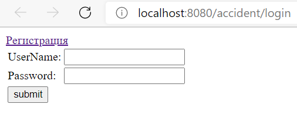
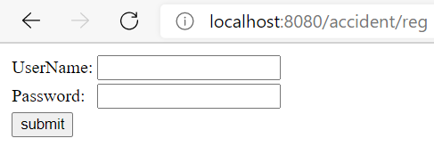
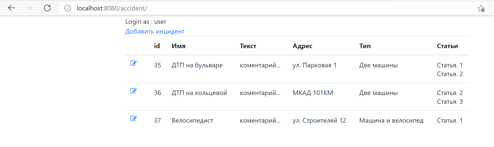
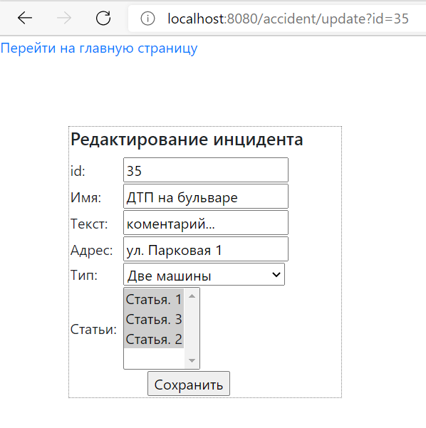
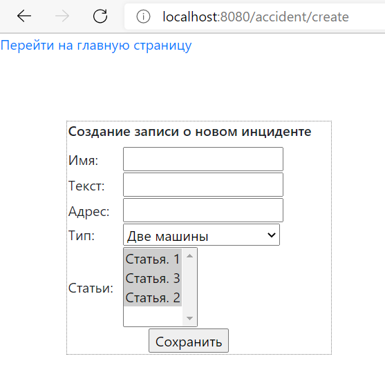

# job4j_car_accident
В блоке Spring мы будем разрабатывать проект - Автонарушители.
Пользователь добавляет описание автонарушение. 
В заявлении указывает: адрес, номер машины, описание нарушения.

В данном проекте реализовано приложение с использованием технологий Spring-boot, Spring-ORM, Spring-Security, Spring-Web. 
Использован шаблон проектирования MVC, view формы jsp, валидация форм с помощью JS scripts, ORM provider Hibernate, DAO реализация PostgresSQL.

### Вид приложения:
Аутентификации пользователя.

Регистрация

Список всех происшествий

Редактирование происшествия

Добавление нового происшествия

### Сборка и запуск

Для сборки использовался Maven.
Перед запуском необходимо создать БД в Postgres и изменить 
[конфигурационный файл](src/main/resources/app.properties) для целевой БД.